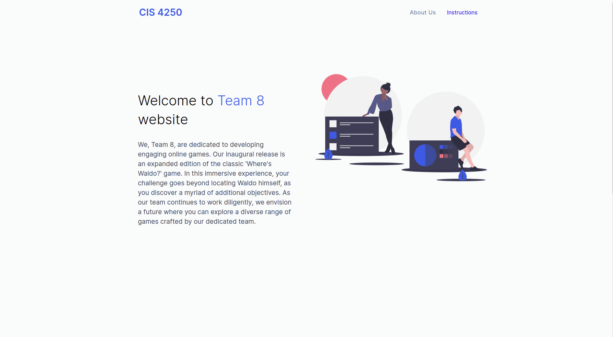
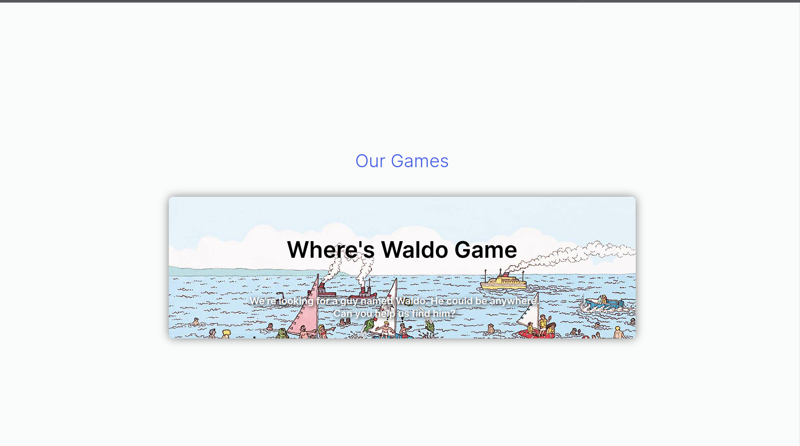
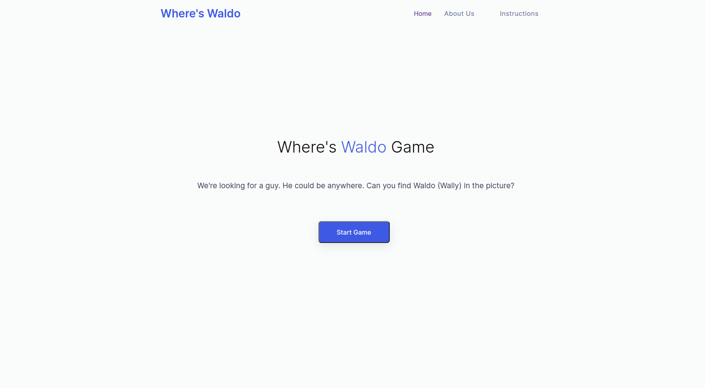
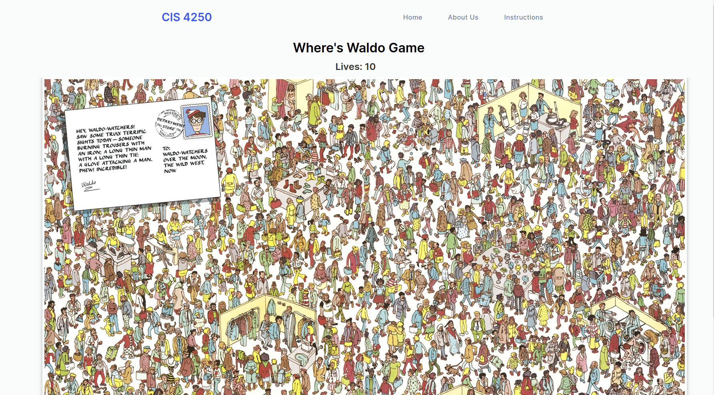
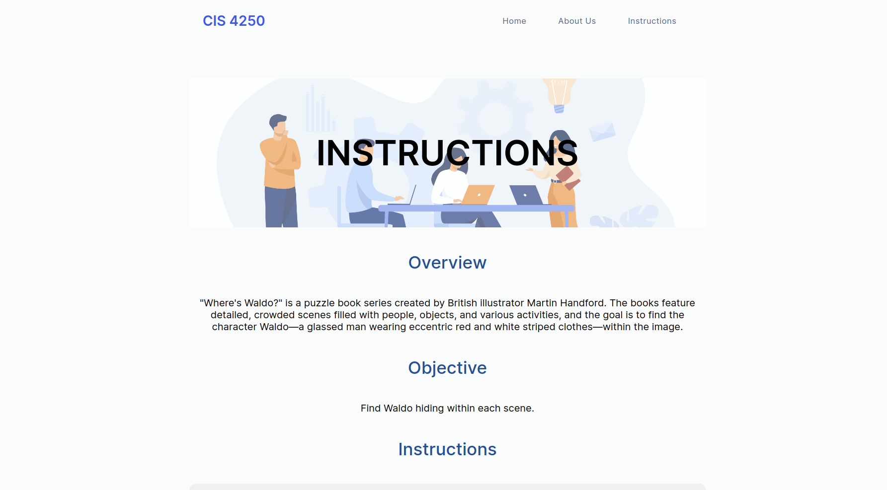
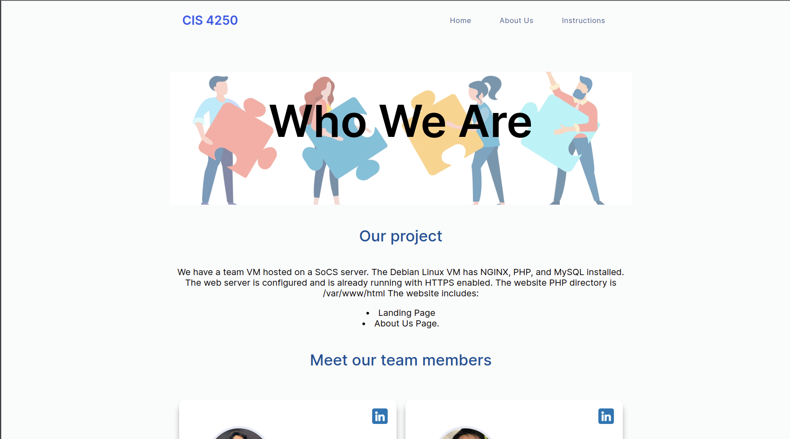

# W24 CIS*4250 Team 8 Sprint 2

## Authors
 Harir Al-Rubaye, Nour Tayem, Thulasi Jothiravi, Rehan Nagoor Mohideen, Harikrishan Singh, and Ivan Odiel Magtangob 

## Contents of this file
 * Description
 * Visuals
 * Requirements
 * Installation 
 * Usage (Local Development)

## Description
The majority of Sprint 2 was spent brainstorming what games to add into the website. The team ended up choosing
to create our implementation of the "Where's Waldo" game.

The site has been updated to support navigation to a new game page where Where's Waldo can be played. Basic functionalities
like a scoring system and game over screen have been implemented.

Other updates include:
- Added an Instructions page
- Added PHP linting as a part of the CI/CD pipeline

## Visuals

### Landing Page
{width=70%} 
{width=70%}


### Where's Waldo Game
{width=70%}
{width=70%}

### Instructions
{width=70%}

### About Us
{width=70%}
## Requirements 

### To run in local development 
1. Install Docker engine: https://docs.docker.com/engine/install/ubuntu/#install-using-the-repository
2. Install Docker Desktop: https://www.docker.com/products/docker-desktop/

## Installation
1. Go to the page of the repository that you want to clone (sprint-2 branch) 
2. Click on “Clone or download” and copy the URL.
3. Use the git clone command along with the copied URL from earlier.
4. Run the following on the command line: 

```
$ git clone --branch sprint-2 https://github.com/USERNAME/REPOSITORY
```
5. Press Enter.

## Usage (Local Development)
1. Pull branch sprint-2
2. Make sure your docker engine is running (by launching docker)
3. Run: `make` which will run the `docker compose up` and nginx/php will run on localhost:8000
4. Run: `make down`: which will run `docker compose down` and close the docker enviroment [After you are done]

 * Access the web application at the following URL: http://localhost:8000/


## Additional Research

### PHP_CodeSniffer for PHP Linting (CI/CD)
Research for CodeSniffer by Ivan Odiel Magtangob

#### Resources:
1. https://github.com/squizlabs/PHP_CodeSniffer
2. https://github.com/squizlabs/PHP_CodeSniffer/wiki/Configuration-Options

#### 1. What is PHP_CodeSniffer?
PHP_CodeSniffer is a set of two PHP scripts; the main `phpcs` script that tokenizes PHP, JavaScript and CSS files to
detect violations of a defined coding standard, and a second `phpcbf` script to automatically correct coding standard
violations. PHP_CodeSniffer is an essential development tool that ensures your code remains clean and consistent.

#### 2. Installation
To avoid modifying the VM, the two PHP_CodeSniffer scripts were installed into the repository using `curl`:

```
curl -OL https://squizlabs.github.io/PHP_CodeSniffer/phpcs.phar
curl -OL https://squizlabs.github.io/PHP_CodeSniffer/phpcbf.phar
```

#### 3. Usage
To use either script:

```
phpcs /path/to/code/myfile.php
phpcbf /path/to/code/myfile.php
```

#### 4. Configuration
PHP_CodeSniffer can be further configured to ignore certain warnings, enable coloured output messages, etc.. Settings
such as these can be implemented in a `CodeSniffer.conf` file:

```
<?php
 $phpCodeSnifferConfig = array (
  'colors' => '1',
  'ignore_warnings_on_exit' => '1',
);
?>
```

Some other configuration options can also be added within the PHP files to be linted, or specified in the command
when executing the script. For example, to ignore all of a certain error:

```
phpcs --exclude=Generic.Files.LineEndings /path/to/code/myfile.php
```