# W24 CIS*4250 Team 8 Sprint 6
Team Lead: Harikrishan Singh

## Authors
 Harir Al-Rubaye, Nour Tayem, Thulasi Jothiravi, Rehan Nagoor Mohideen, Harikrishan Singh, and Ivan Odiel Magtangob

## Contents of this file
 * Description
 * Visuals
 * Requirements
 * Installation
 * Usage (Local Development)

## Description [NEW]
During Sprint 5, the team focused on updating the game functionality. Several features and improvements were implemented:

1. **Hint button**: In both the games a hint button was added. This button generates a corresponding hint to the level when playing 'i-spot'games.

2. **Hint I-spot**: The hint button generates a corresponding hint to the level when playing 'i-spot'games.

3. **Hint Hangman**: The hint button in the game produces a brief explanation on the word the user is trying to guess.

4. **Seceret Page**: There is a secret page that user reaches by finding the 3 clues spread throughout the website.

5. **Secrets**: A secret word is added on the homepage, gameoverpage and about us page. These are stored in cokkies and changed each time the webpage reloads.

6. **See word if u lose hangman**:Now you can see the words on the game over screen after you lose the hangman game.

### What's New in Sprint 6
 We just wrapped up Sprint 6, and it's packed with cool stuff to enhance your experience with our cryptogram puzzle game. Let’s dive into what we’ve been up to:

1. **Cryptogram Magic**: The frontend and backend got a major facelift, making puzzles more fun and interactive.
2. Jumping into solving puzzles is now faster with our streamlined authentication and smoother navigation.
3. We’ve hidden a riddle within the cryptograms. Solve it, and bask in the glory of your puzzle mastery.


## Visuals

### Hangman Game Menu
|                   Game Start Page                    |                         Game Menu                          |
| :--------------------------------------------------: | :--------------------------------------------------------: |
| 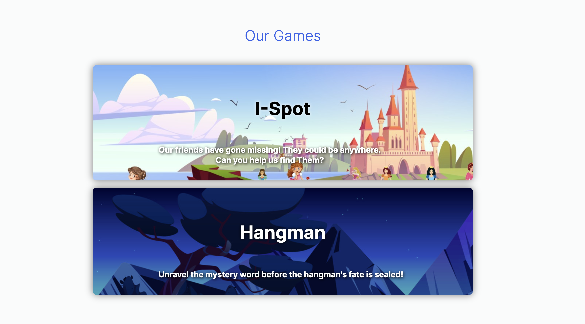 | 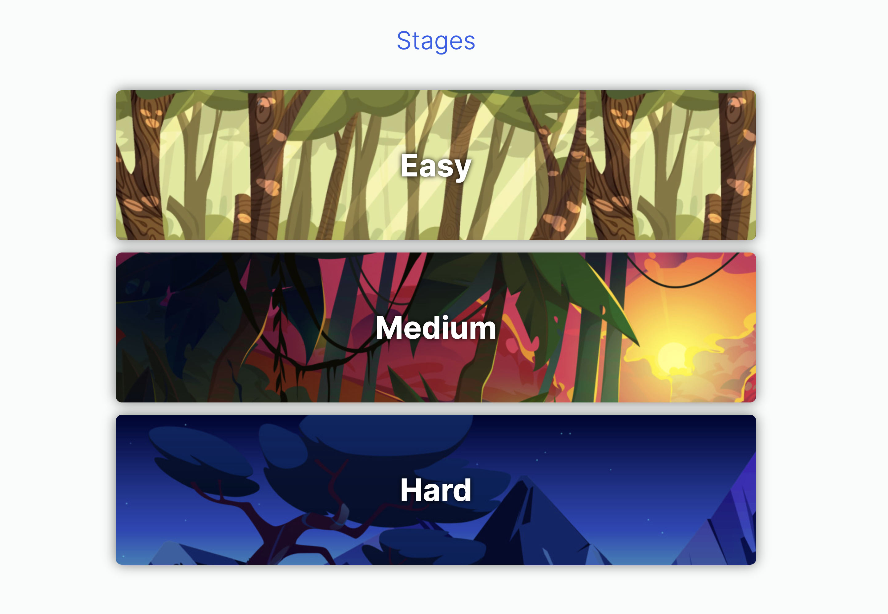 |

### Hangman Game (Different Stages)
|                         Easy Level                         |                       Medium Level                        |
| :-----------------------------------------------------: | :--------------------------------------------------: |
| 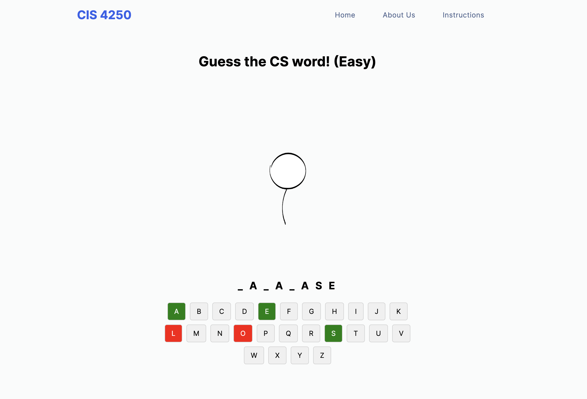 | 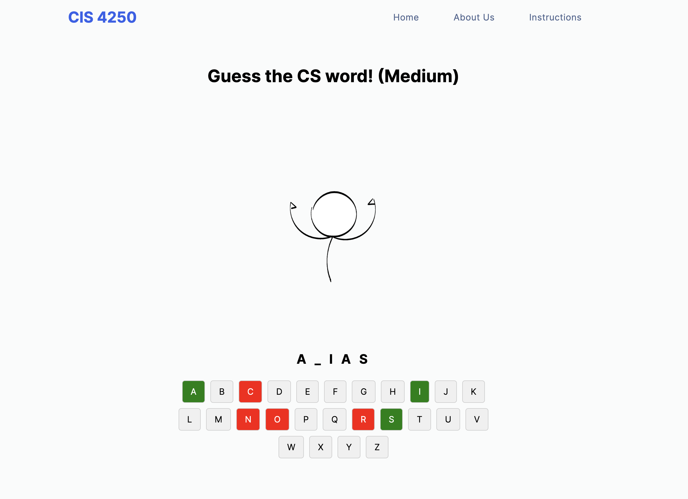 |

|                         Hard Level                         |                        Game Over                        |
| :-----------------------------------------------------: | :-----------------------------------------------------: |
| 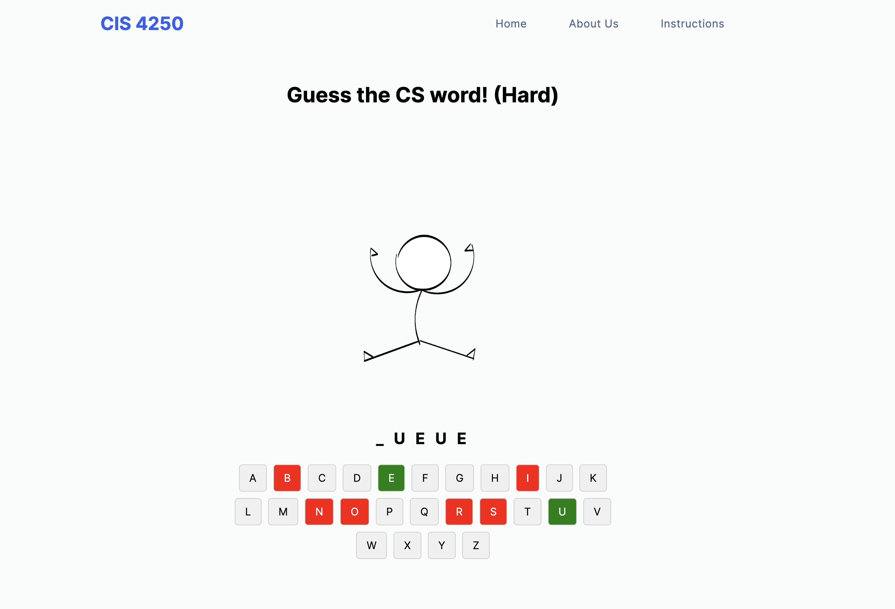 | 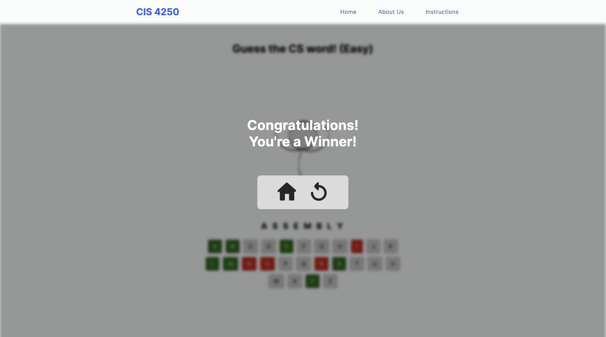 |


### Landing Page
|                  Landing Page - part 1                   |                  landing Page - part 2                   |
| :------------------------------------------------------: | :------------------------------------------------------: |
| 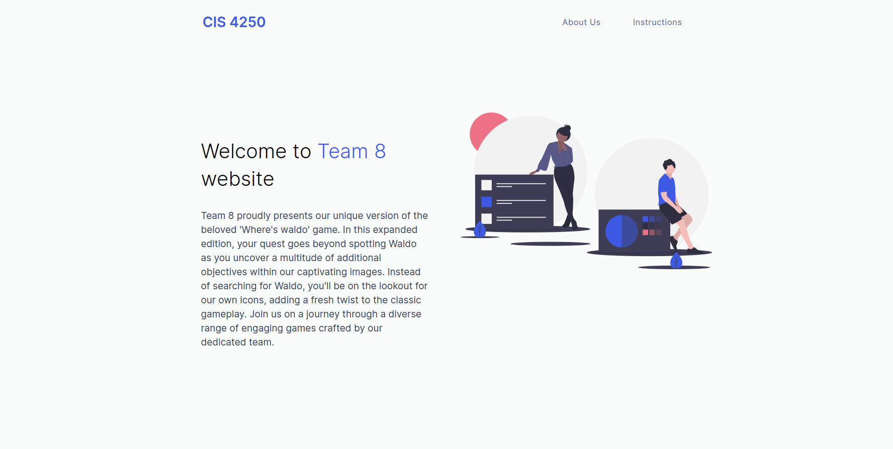 | 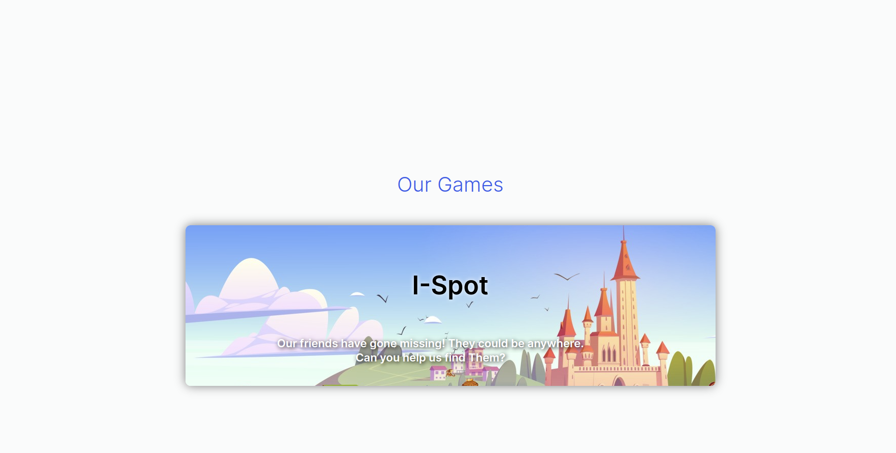 |

### I-Spot Game Menu
|                   Game Start Page                    |                         Game Menu                          |
| :--------------------------------------------------: | :--------------------------------------------------------: |
| 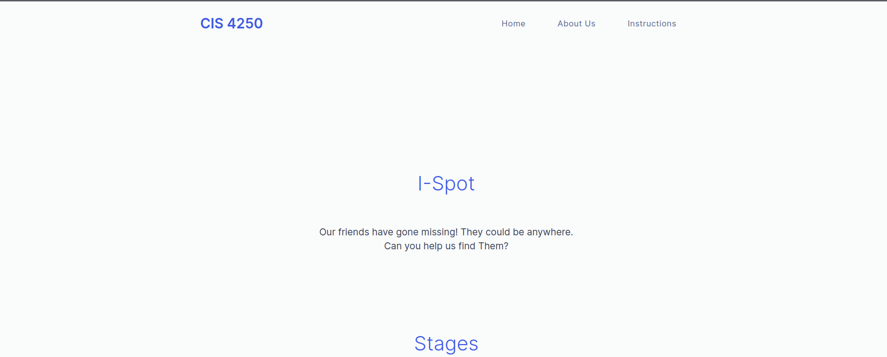 | 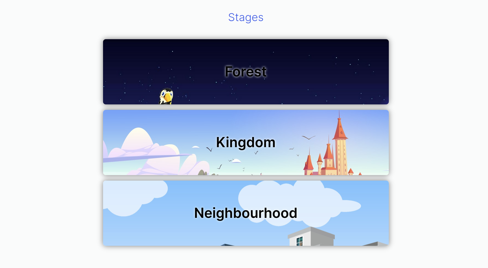 |

### I-Spot Game (Different Stages)
|                         Stage 1                         |                       Stage 2                        |
| :-----------------------------------------------------: | :--------------------------------------------------: |
| 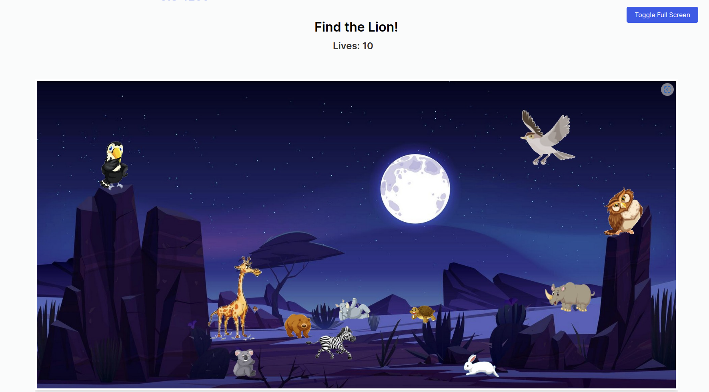 | 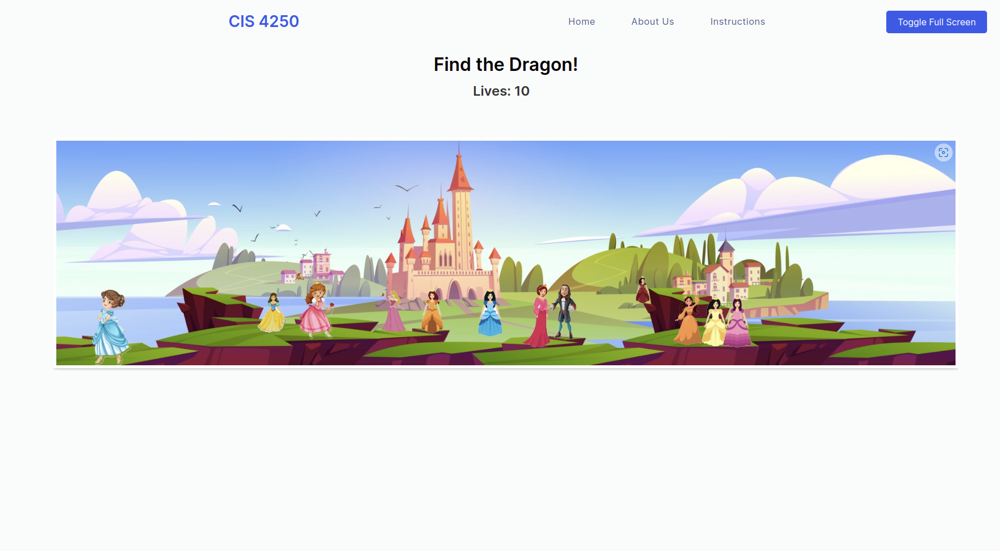 |

|                         Stage 3                         |                        Game Over                        |
| :-----------------------------------------------------: | :-----------------------------------------------------: |
| 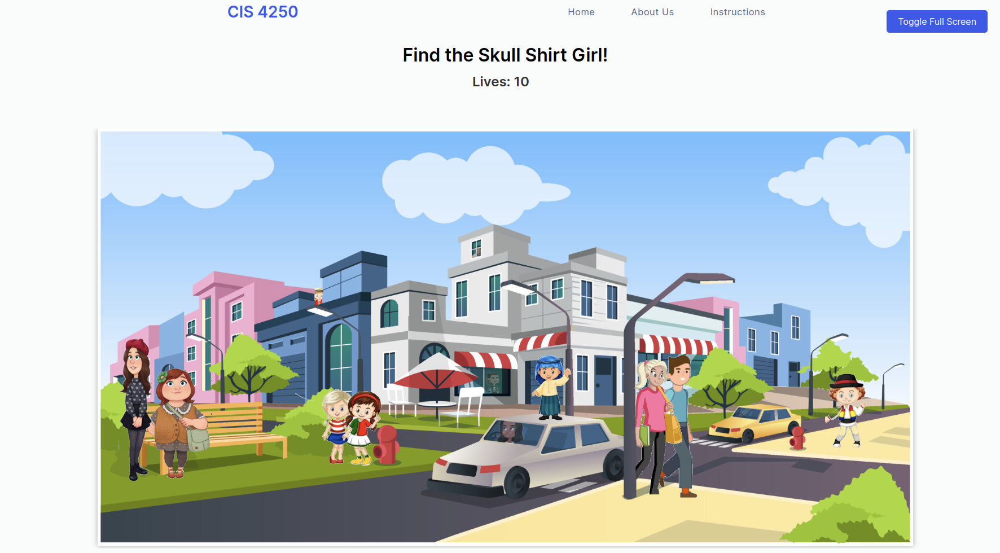 | 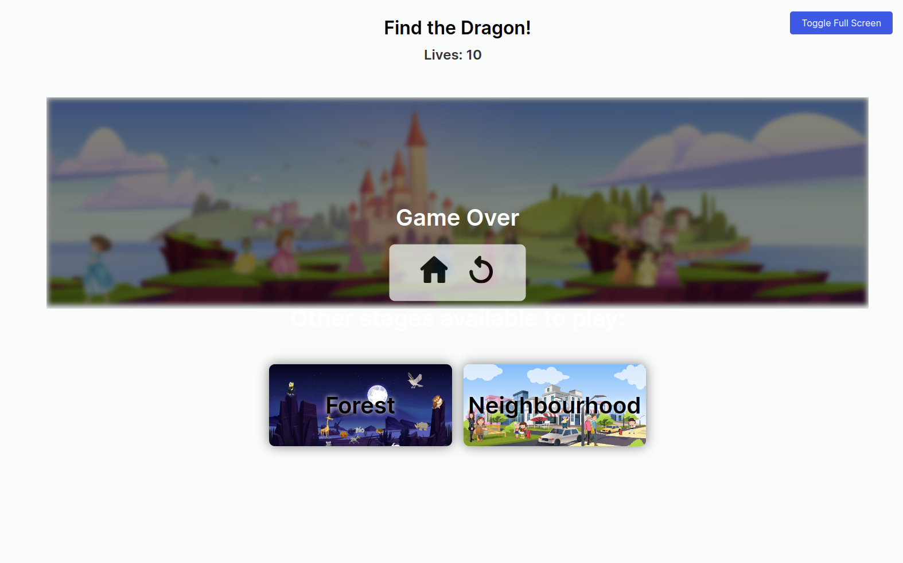 |


### Landing Page
|                  Landing Page - part 1                   |                  landing Page - part 2                   |
| :------------------------------------------------------: | :------------------------------------------------------: |
|  |  |

### Learn More

|                   Instructions Page                   |                 About Us Page                 |
| :---------------------------------------------------: | :-------------------------------------------: |
| 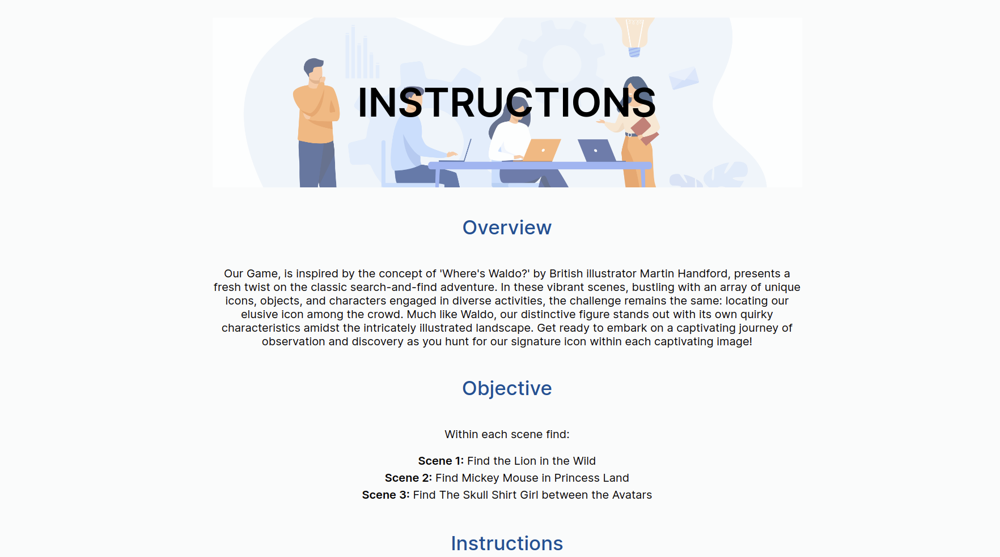 | 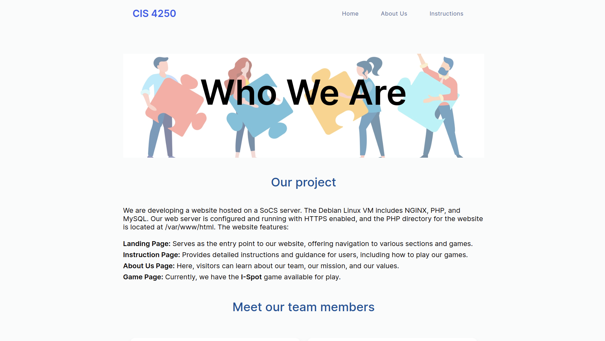 |

## User Testing Results
(Please find User Testing Script and Result documentation in _user_testing/results_ directory)

| Task & Question                             | Tester 1                                          | Tester 2                                          | Tester 3                                          | Tester 4                                          | Tester 5                                          |
|---------------------------------------------|---------------------------------------------------|---------------------------------------------------|---------------------------------------------------|---------------------------------------------------|---------------------------------------------------|
| **Task 1: Onboarding Process**              | Found “Games” section after initial confusion; clear once seen. | Could be more interactive.                        | Used phone; not specified.                        | Clear enough to understand the game process.      | Straightforward, nice overview.                   |
| **Task 2: Visual Style & Engagement**       | Likes different levels/themes; progressively harder. | Fullscreen stretches image; game is fun.          | Pretty nice; works well.                          | Friendly UI; straightforward rules.               | Nice visuals; could be better with multiple objects. |
| **Task 3: Transition Between Levels**       | Smooth transition; intuitive controls.             | Made sense; zoom controls not obvious.            | Inconvenient navigation; game over screen not phone compatible. | Smooth; clear indicators of goal achievement.     | Easy transition; suggests showing target object image. |
| **Task 4: Full-Screen Mode & Zoom**         | Intuitive controls; full-screen appreciated.       | Full-screen button confusion.                     | Loses lives in full-screen on phone.              | Easy navigation; zoom enhances experience.        | Easy-to-use full-screen button; suggests hint for zoom. |
| **Task 5: Finding Developer Info**          | “About Us” button was helpful.                     | Not specified.                                    | Not difficult to find.                            | Depends on game popularity and developer openness. | Easy to use “About Us” link; can access developer LinkedIn. |
| **Task 6: Website Navigation**              | Prefers clicking logo for home; simple game but engaging. | Navigation is nice; some levels difficult at first. | Easy; logo should return to homepage.             | Simple and intuitive; medium difficulty to locate game. | Consistent navigation bar; easy to access different webpages. |
| **Task 7: Overall Impressions**             | Would recommend; likes the game concept.          | Might play again; 4/5 stars.                      | It’s fine; would not play but recognizes potential. | Positive; likely to recommend.                    | Likely to play again; rates 8.8/10.               |


## Requirements

### To run in local development
1. Install Docker engine: https://docs.docker.com/engine/install/ubuntu/#install-using-the-repository
2. Install Docker Desktop: https://www.docker.com/products/docker-desktop/

## Installation
1. Go to the page of the repository that you want to clone (sprint-2 branch)
2. Click on “Clone or download” and copy the URL.
3. Use the git clone command along with the copied URL from earlier.
4. Run the following on the command line:

```
$ git clone --branch sprint-2 https://github.com/USERNAME/REPOSITORY
```
5. Press Enter.

## Usage (Local Development)
1. Pull branch sprint-2
2. Make sure your docker engine is running (by launching docker)
3. Run: `make` which will run the `docker compose up` and nginx/php will run on localhost:8000
4. Run: `make down`: which will run `docker compose down` and close the docker enviroment [After you are done]

 * Access the web application at the following URL: http://localhost:8000/


## Additional Research

### PHP_CodeSniffer for PHP Linting (CI/CD)
Research for CodeSniffer by Ivan Odiel Magtangob

#### Resources:
1. https://github.com/squizlabs/PHP_CodeSniffer
2. https://github.com/squizlabs/PHP_CodeSniffer/wiki/Configuration-Options

#### 1. What is PHP_CodeSniffer?
PHP_CodeSniffer is a set of two PHP scripts; the main `phpcs` script that tokenizes PHP, JavaScript and CSS files to
detect violations of a defined coding standard, and a second `phpcbf` script to automatically correct coding standard
violations. PHP_CodeSniffer is an essential development tool that ensures your code remains clean and consistent.

#### 2. Installation
To avoid modifying the VM, the two PHP_CodeSniffer scripts were installed into the repository using `curl`:

```
curl -OL https://squizlabs.github.io/PHP_CodeSniffer/phpcs.phar
curl -OL https://squizlabs.github.io/PHP_CodeSniffer/phpcbf.phar
```

#### 3. Usage
To use either script:

```
phpcs /path/to/code/myfile.php
phpcbf /path/to/code/myfile.php
```

#### 4. Configuration
PHP_CodeSniffer can be further configured to ignore certain warnings, enable coloured output messages, etc.. Settings
such as these can be implemented in a `CodeSniffer.conf` file:

```
<?php
 $phpCodeSnifferConfig = array (
  'colors' => '1',
  'ignore_warnings_on_exit' => '1',
);
?>
```

Some other configuration options can also be added within the PHP files to be linted, or specified in the command
when executing the script. For example, to ignore all of a certain error:

```
phpcs --exclude=Generic.Files.LineEndings /path/to/code/myfile.php
```
